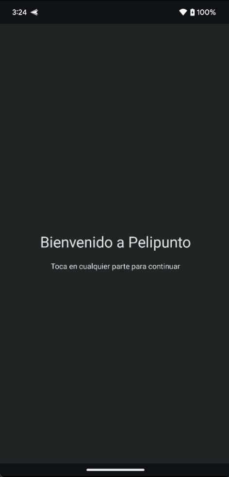
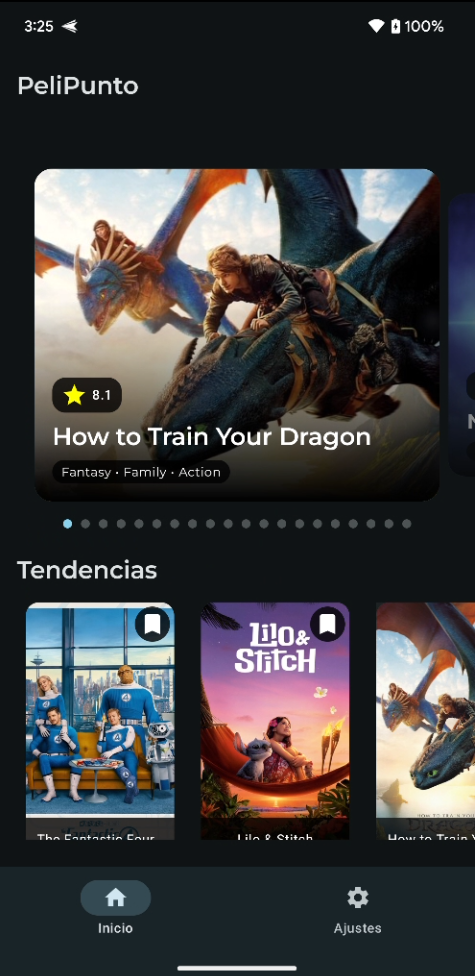
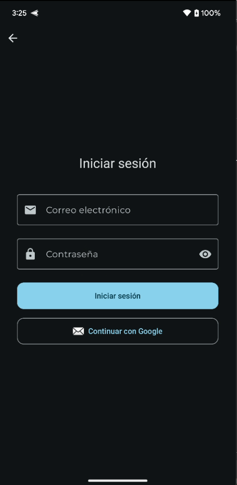
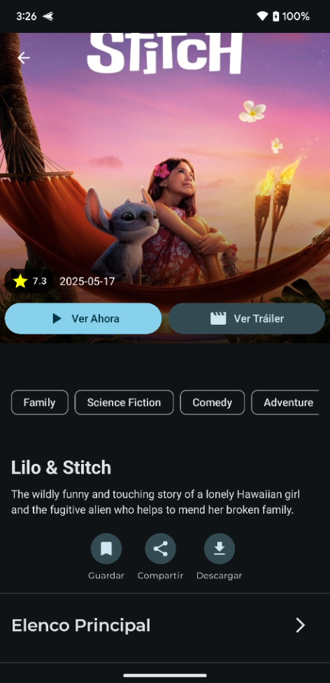
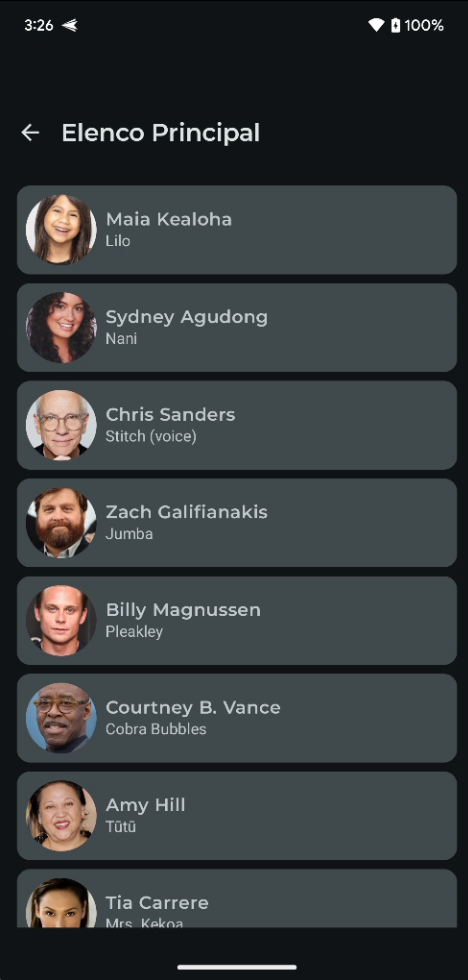
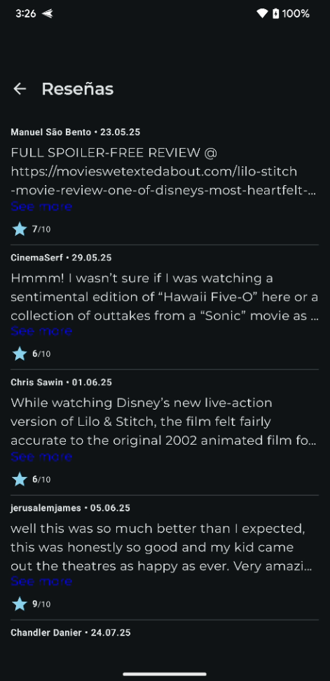
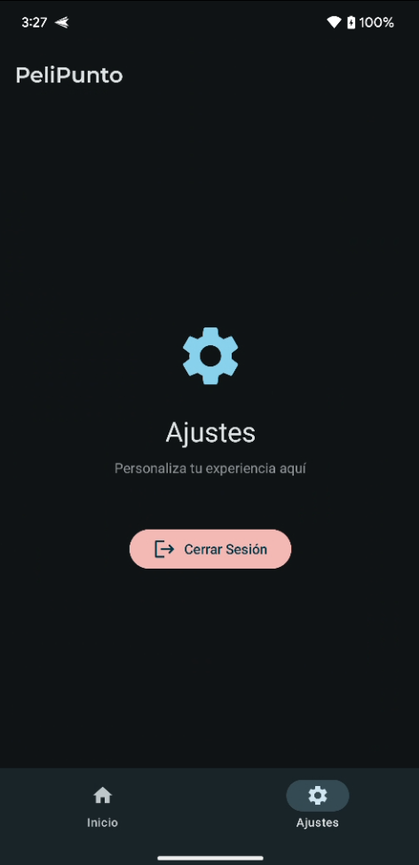

<h1 align="center">
  Pelipunto: Explorador de Películas para Android
</h1>
<a name="readme-top"></a>

<h4 align="center">
  Aplicación Android nativa para explorar, descubrir y gestionar películas.<br>
  Construida con Arquitectura Limpia Multi-módulo, Kotlin, y un moderno UI/UX con Jetpack Compose.
</h4>


####  Proyecto de aprendizaje y demostración de arquitectura y UI/UX Android moderna.


<h2 align="center">Recorrido de la Aplicación</h2>

<p align="center">
  Un tour visual a través de las principales pantallas de la aplicación, mostrando el flujo de usuario completo desde la bienvenida hasta la gestión de la cuenta.
</p>

| Pantalla de Bienvenida y Autenticación | Pantallas Principales de Contenido |
| :------------------------------------: | :--------------------------------: |
|  |  |
| **Bienvenida y Elección.** El usuario es recibido y puede optar por iniciar sesión o registrarse. | **Pantalla Principal.** Un `Scaffold` con `BottomBar` presenta un carrusel interactivo y las tendencias. |
|  |  |
| **Inicio de Sesión.** Interfaz limpia para autenticación con Firebase (Google o Email). | **Detalles de Película.** Diseño inmersivo que ocupa toda la pantalla para una experiencia sin distracciones. |

| Pantallas Secundarias y de Gestión |
| :----------------------------------: |
|  |
| **Lista de Elenco.** Muestra todos los actores principales de la película seleccionada. |
|  |
| **Lista de Reseñas.** Permite al usuario leer todas las reseñas disponibles. |
|  |
| **Ajustes y Cierre de Sesión.** El usuario puede gestionar su cuenta y cerrar sesión de forma segura. |

<h3 align="center">Creado y Adaptado por:</h3>
<p align="center">
  <a href="https://github.com/gabiru05" title="Gabriel Ruiz">
    
  </a>
     
  <a href="https://github.com/MrT4ttoo" title="Adolfo López">
    
  </a>
</p>
<p align="center">
  Gabriel Ruiz        Adolfo López
</p>


<h2 align="center">Características Principales</h2>

<ul>
  <li> <strong>Rediseño de UI/UX con Material Design 3:</strong> Interfaz completamente renovada, con bordes definidos, espaciado consistente y una estética moderna y limpia.</li>
  <li> <strong>Navegación Centralizada con Scaffold:</strong> Arquitectura de UI robusta con un único `Scaffold` que gestiona de forma inteligente la `TopAppBar` y `BottomAppBar`.</li>
  <li> <strong>Carrusel Interactivo Mejorado:</strong> El carrusel de la pantalla principal ahora cuenta con animaciones de `HorizontalPager` y efectos visuales que mejoran la experiencia de descubrimiento.</li>
  <li> <strong>Listas Completas para Elenco y Reseñas:</strong> Pantallas dedicadas para explorar en profundidad la información de cada película.</li>
  <li> <strong>Sistema de Autenticación Completo:</strong> Inicio de sesión con Google y mediante correo/contraseña utilizando Firebase Authentication.</li>
  <li> <strong>Arquitectura Limpia Multi-módulo:</strong> El código está separado por capas (presentación, dominio, datos) y funcionalidades, facilitando el mantenimiento y la escalabilidad.</li>
  <li> <strong>Interfaz 100% Compose:</strong> UI completamente construida con Jetpack Compose y Material 3.</li>
  <li> <strong>Asincronía con Coroutines:</strong> Todas las operaciones de red y base de datos se manejan de forma eficiente con Coroutines y Flow.</li>
</ul>

<h3 align="center">Funcionalidades Planeadas (Roadmap)</h3>
<ul>
  <li> Añadir seguridad basada en <strong>Tokens (JWT)</strong> con tiempo de expiración.</li>
  <li> Desarrollar la funcionalidad de <strong>calificar películas</strong> y guardar la puntuación por usuario.</li>
  <li> Crear una lista de "Favoritos" o "Películas para ver".</li>
</ul>


<h2 align="center">Tecnologías Utilizadas</h2>

<ul>
  <li> <strong>Kotlin:</strong> Lenguaje de programación principal.</li>
  <li> <strong>Jetpack Compose:</strong> Toolkit para construir UI nativas.</li>
  <li> <strong>Arquitectura Limpia Multi-módulo.</strong></li>
  <li> <strong>Hilt:</strong> Inyección de dependencias.</li>
  <li> <strong>Firebase Authentication:</strong> Para el sistema de login y registro.</li>
  <li> <strong>Retrofit & OkHttp:</strong> Cliente HTTP para consumir la API REST.</li>
  <li> <strong>Coroutines & Flow:</strong> Para manejo de asincronía.</li>
  <li><strong>Room:</strong> Librería de persistencia para la base de datos local.</li>
  <li><strong>Coil:</strong> Carga de imágenes.</li>
  <li> <strong>Android Studio.</strong></li>
</ul>


<h2 align="center">Instalación y Uso</h2>

1.  **Clonar el repositorio:**
    ```bash
    git clone https://github.com/gabiru05/Pelipunto.git
    cd Pelipunto
    ```

2.  **Configurar Clave de API:**
    *   Este proyecto requiere una clave de API de The Movie Database (TMDb).
    *   En la carpeta raíz del proyecto, crea un archivo llamado `local.properties`.
    *   Añade tu clave de API en este formato:
        ```properties
        tmdb_api_key=TU_CLAVE_DE_API_AQUI
        ```

3.  **Abrir en Android Studio:**
    *   Abre Android Studio.
    *   Selecciona `File > Open...` y elige la carpeta `Pelipunto` que clonaste.
    *   Espera a que Gradle sincronice el proyecto.

4.  **Ejecutar la aplicación:**
    *   Conecta un dispositivo Android o inicia un Emulador.
    *   Haz clic en el botón "Run 'app'" (▶️).


<p align="right"><a href="#readme-top">Volver arriba</a></p>