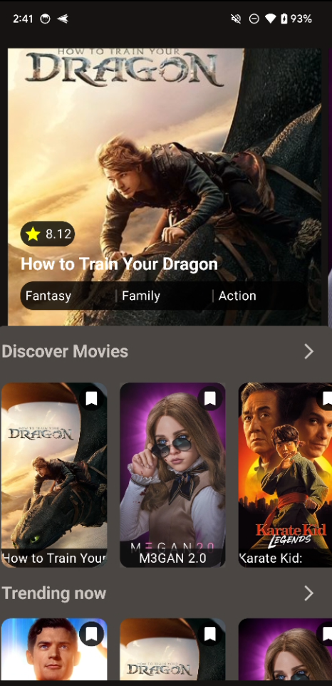
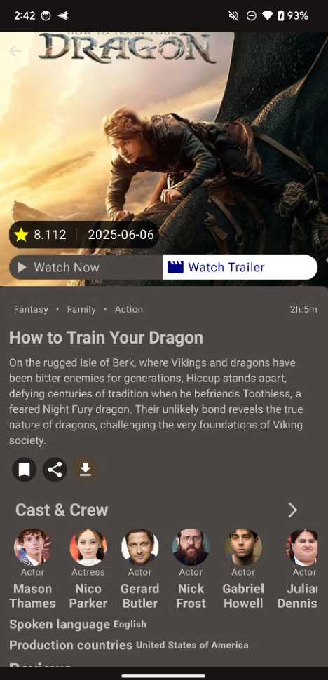

<h1 align="center">
  Pelipunto: Explorador de Películas para Android
</h1>
<a name="readme-top"></a>

<h4 align="center">
  Aplicación Android nativa para explorar, descubrir y calificar películas.<br>
  Construida con Arquitectura Limpia Multi-módulo, Kotlin, y Jetpack Compose.
</h4>


####  Proyecto de aprendizaje y demostración de arquitectura Android moderna.


<h2 align="center">Descripción del Proyecto</h2>

<p align="center">
  <strong>Pelipunto</strong> es una aplicación Android que permite a los usuarios explorar las películas más populares y las que son tendencia, utilizando la API de <a href="https://www.themoviedb.org/">The Movie Database (TMDb)</a>. El proyecto nació como una refactorización y modernización de una base de código existente, con el objetivo de implementar las mejores prácticas de desarrollo de software, incluyendo <strong>Arquitectura Limpia</strong>, un diseño <strong>multi-módulo</strong>, e inyección de dependencias con <strong>Hilt</strong>. La interfaz de usuario está desarrollada íntegramente con <strong>Jetpack Compose</strong> y Material 3, ofreciendo una experiencia moderna y reactiva.
</p>

<p align="center">
  
  
</p>

<h3 align="center">Creado/Adaptado por:</h3>
<p align="center">
  <a href="https://github.com/gabiru05">Gabriel Ruiz (gabiru05)</a>
  </p>


<h2 align="center">Características Principales</h2>

<ul>
  <li> <strong>Arquitectura Limpia Multi-módulo:</strong> El código está separado por capas (presentación, dominio, datos) y funcionalidades (discover, trending, detail), facilitando el mantenimiento y la escalabilidad.</li>
  <li> <strong>Descubrimiento de Películas:</strong> Pantalla principal con un carrusel interactivo que muestra las películas populares del momento.</li>
  <li> <strong>Tendencias:</strong> Sección que muestra una lista de las películas en tendencia.</li>
  <li> <strong>Detalles Completos:</strong> Al seleccionar una película, se accede a una pantalla de detalles con sinopsis, póster, y más información.</li>
  <li> <strong>Interfaz 100% Compose:</strong> UI completamente construida con Jetpack Compose y Material 3.</li>
  <li> <strong>Asincronía con Coroutines:</strong> Todas las operaciones de red y base de datos se manejan de forma eficiente con Coroutines y Flow.</li>
</ul>

<h3 align="center">Funcionalidades Planeadas (Roadmap)</h3>
<ul>
  <li> Implementar sistema de <strong>Login y Registro</strong> de usuarios.</li>
  <li> Añadir seguridad basada en <strong>Tokens (JWT)</strong> con tiempo de expiración.</li>
  <li> Desarrollar la funcionalidad de <strong>calificar películas</strong> y guardar la puntuación por usuario.</li>
  <li> Opción de <strong>cierre de sesión</strong> (Logout).</li>
</ul>


<h2 align="center">Estructura del Proyecto</h2>

<p align="center">
  El proyecto sigue una arquitectura limpia y está dividido en módulos por funcionalidad y por capa.
</p>

-   `app/`: Módulo principal que une toda la aplicación y contiene la `MainActivity` y la clase `Application`.
-   `core/`: Módulo con código compartido por toda la app.
    -   `core/common`: Constantes y clases de utilidad.
    -   `core/database`: Configuración de Room (Base de datos).
    -   `core/network`: Configuración de Retrofit y OkHttp.
    -   `core/ui`: Componentes de Jetpack Compose reutilizables.
-   `discover/`: Módulo de la funcionalidad "Descubrir".
    -   `discover/data`: Implementación del repositorio y fuentes de datos.
    -   `discover/domain`: Casos de uso y modelos de dominio.
    -   `discover/ui`: Pantallas y ViewModels de la funcionalidad.
-   `movie/` y `trending/`: Módulos similares para sus respectivas funcionalidades.


<h2 align="center">Tecnologías Utilizadas</h2>

<ul>
  <li> <strong>Kotlin:</strong> Lenguaje de programación principal.</li>
  <li> <strong>Jetpack Compose:</strong> Toolkit para construir UI nativas.</li>
  <li> <strong>Arquitectura Limpia Multi-módulo.</strong></li>
  <li> <strong>Hilt:</strong> Inyección de dependencias.</li>
  <li> <strong>Retrofit & OkHttp:</strong> Cliente HTTP para consumir la API REST.</li>
  <li> <strong>Coroutines & Flow:</strong> Para manejo de asincronía.</li>
  <li><strong>Room:</strong> Librería de persistencia para la base de datos local.</li>
  <li><strong>Coil:</strong> Carga de imágenes.</li>
  <li> <strong>Android Studio.</strong></li>
</ul>


<h2 align="center">Instalación y Uso</h2>

1.  **Clonar el repositorio:**
    ```bash
    git clone https://github.com/gabiru05/Pelipunto.git
    cd Pelipunto
    ```

2.  **Configurar Clave de API:**
    *   Este proyecto requiere una clave de API de The Movie Database (TMDb).
    *   En la carpeta raíz del proyecto, crea un archivo llamado `local.properties`.
    *   Añade tu clave de API en este formato:
        ```properties
        tmdb_api_key=TU_CLAVE_DE_API_AQUI
        ```

3.  **Abrir en Android Studio:**
    *   Abre Android Studio.
    *   Selecciona `File > Open...` y elige la carpeta `Pelipunto` que clonaste.
    *   Espera a que Gradle sincronice el proyecto.

4.  **Ejecutar la aplicación:**
    *   Conecta un dispositivo Android o inicia un Emulador.
    *   Haz clic en el botón "Run 'app'" (▶️).


<p align="right"><a href="#readme-top">Volver arriba</a></p>